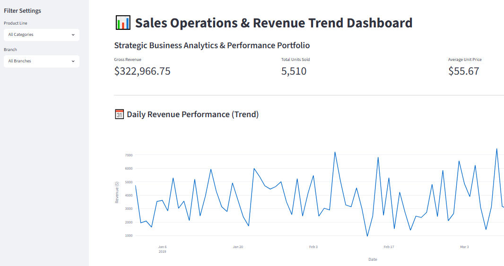

■Sales Operations Dashboard (Portfolio)

Japanese Version (国内ビジネス・社内報告用): [Link to Live App](https://sales-ops-dashboard-ja.streamlit.app/)

実務を想定した営業・売上データ（匿名化済み）をベースに、
Sales Opsが意思決定で使用するダッシュボードのプロトタイプをStreamlitで構築しました。

■本プロジェクトの狙い
データの仕様や項目（Product lineやBranchなど）を活かし、
経営陣や現場のマネージャーが「どのカテゴリが伸びているか」「どの店舗が売上に貢献しているか」
といったビジネスのインサイト（気づき）を一目で得られる「仕組み」をデザインしています。

■使用データについて
本アプリで使用しているデータ（sales_data.csv）は、データ分析のポートフォリオおよび実務シミュレーション用として、
Kaggleで公開されているデータセットを使用しています。

※データソース: [Kaggle公開データセット (Supermarket Sales)]()
  実務（Sales Operations）を想定した架空のサンプルデータであり、実際の個人情報や企業の機密情報は一切含まれていません。

■Sales Operations Dashboard (Portfolio)

English Version (For Global/External Ops): [Link to Live App](https://sales-ops-dashboard.streamlit.app/)

This is a prototype sales and revenue dashboard developed using Streamlit, 
built upon digitized operational data (fully anonymized) to streamline executive and regional decision-making.

■Project Objectives
Designed with a core focus on structural utility, this dashboard leverages key transactional dimensions 
(such as `Product line` and `Branch`). It empowers executives and field managers to extract
immediate business insights—such as emerging product trends and regional sales contributions—at a glance.

■Dataset Overview
The underlying data (`SuperMarket Analysis-selected-columns.csv`) utilized for this portfolio
and simulation is derived from a publicly available dataset on Kaggle.

※Data Source: [Kaggle Public Dataset (Supermarket Sales)](https://www.kaggle.com/datasets/faresashraf1001/supermarket-sales)
  Data Integrity: This is a mock dataset tailored for Sales Operations simulations. 
  It contains absolutely no confidential corporate records or personally identifiable information (PII).
